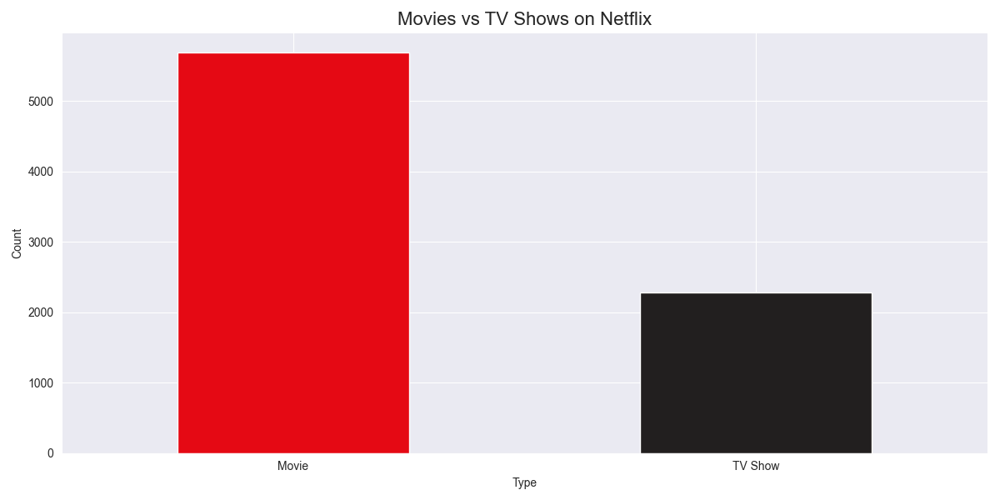
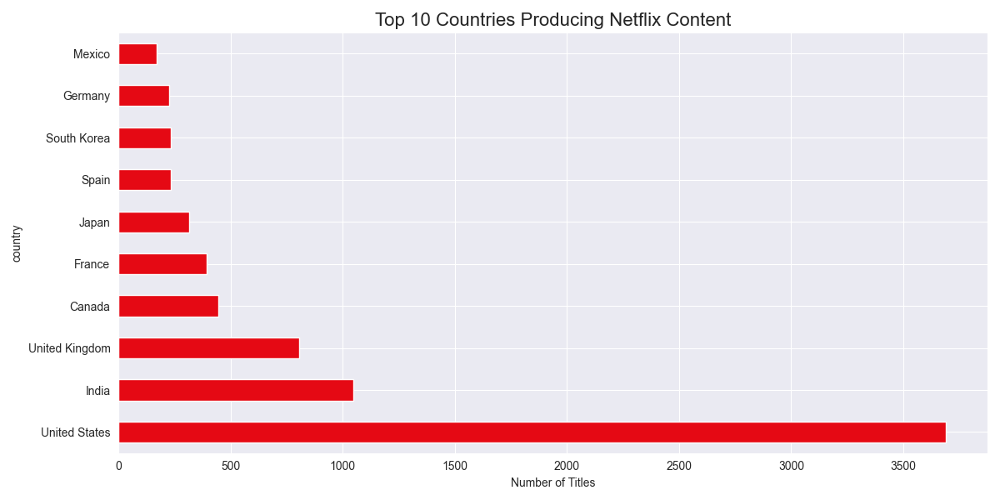
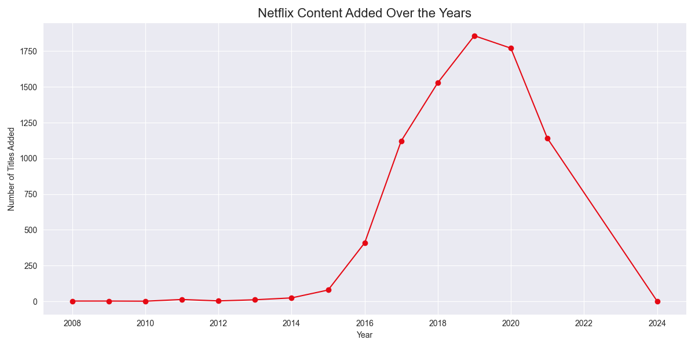
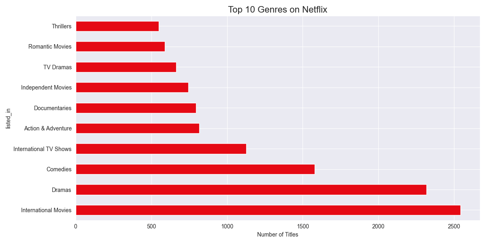
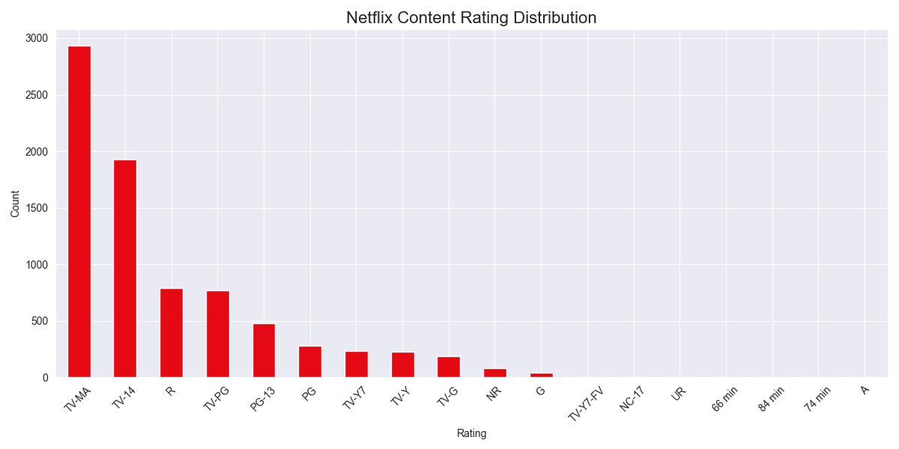

# netflix-analysis
Exploratory data analysis on Netflix Movies and TV Shows dataset using Python

# 🎬 Netflix Movies & TV Shows Analysis – Python

## Overview
Exploratory data analysis (EDA) on the Netflix Movies and TV Shows 
dataset using Python. This project uncovers content trends, popular 
genres, top producing countries, and rating distributions on Netflix.

## 🛠️ Tools & Libraries Used
- Python 3.10
- Pandas — data cleaning & analysis
- Matplotlib — data visualization
- Seaborn — chart styling

## 📂 Dataset
- **Source:** Kaggle — Netflix Movies and TV Shows
- **Size:** 8,800+ titles
- **Features:** title, type, country, date_added, rating, listed_in, etc.

## 🔍 Key Findings
- **Movies dominate** Netflix content over TV Shows
- **United States** is the top content producing country
- **Dramas and Comedies** are the most popular genres
- Netflix content **grew significantly** from 2016–2019
- **TV-MA** is the most common content rating

## 📊 Visualizations

### 🎬 Movies vs TV Shows

### 🌍 Top 10 Countries Producing Netflix Content

### 📈 Content Added Over the Years

### 🎭 Top 10 Genres

### 🔞 Content Rating Distribution

## 💡 Skills Demonstrated
- Exploratory Data Analysis (EDA)
- Data cleaning with Pandas
- Data visualization with Matplotlib & Seaborn
- Handling missing values
- String manipulation and data parsing
